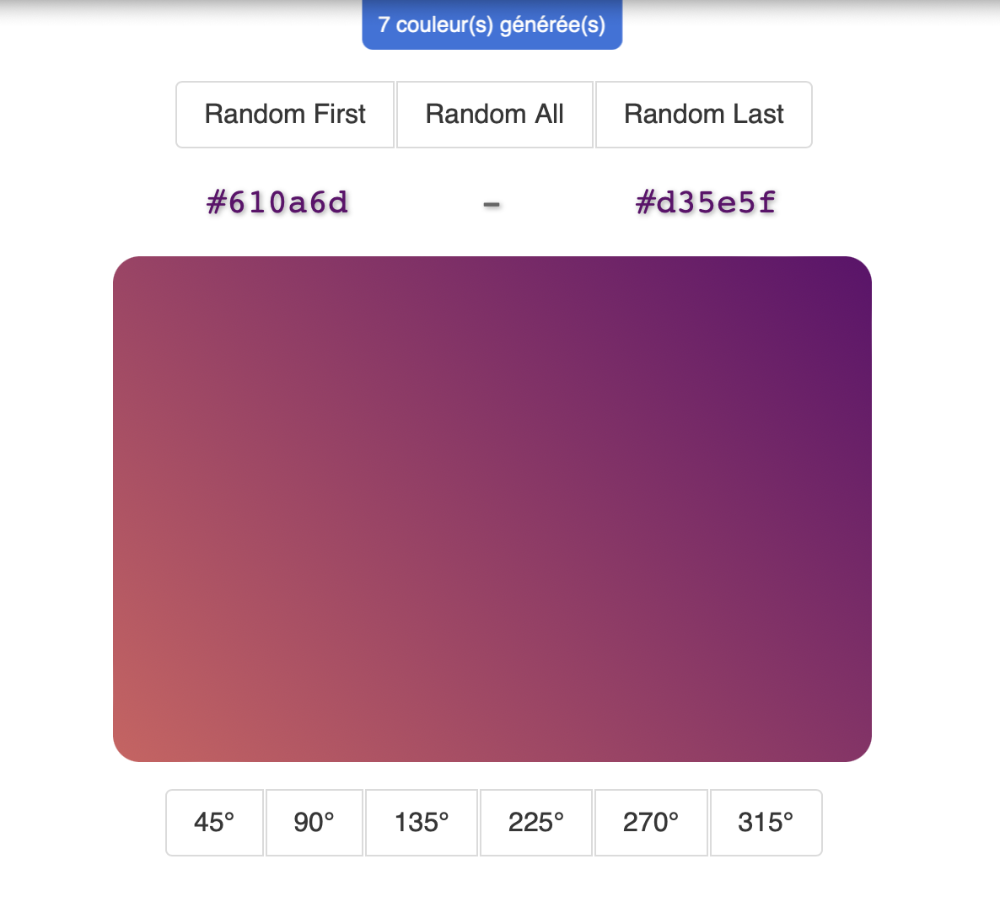

# Challenge Gradient

Ce projet est un challenge que j'ai effectué pendant ma [formation O'Clock](https://oclock.io/formations/developpeur-web-fullstack-javascript), durant le mois de spécialisation React.\
Il s'agissait de développer une application web pour créer des dégradés avec **React** et **Redux**.

## Technologies

- React.js
- Javascript
- Redux
- Sass

## Fonctionnalités

- Pouvoir changer les couleurs du dégradé au hasard: la première, la deuxième, ou les deux en même temps
- Pouvoir changer la direction du dégradé
- Afficher un compteur de couleurs générées
